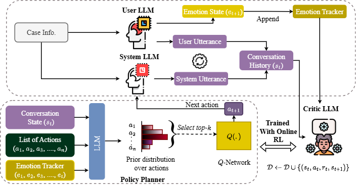

# dialogxpert

Codebase for **ProactiveAI in Conversations** — an approach combining LLM priors with Q-adapters for task-oriented dialogue planning.

This repo explains the following parts:
- Downloading LLM Weights
- How the model is trained
- How the model flows based on the architecture
- Extra information

---

#### Architecure Breakdown



---

### Downloading LLM Weights

Download the LLM model weights locally (it's easier because its faster to load!)

```
python download_llm_weights.py
```

NOTE: 

- You will need to change the `repo_id` in `download_llm_weights.py` to change the LLM weights to download.

- Please ensure that you are logged into huggingface and have the necessary tokens enabled.

---

### Training the model

Before you train the model:
- Decide the dataset to use
- Make the changes to the dataset arg (`get_args_train` -> *--data_name* parameter)
- Make changes to the necessary functions in the code in `env.py`:
    - LLM Policy Prompt: Replace with {dataset_name}_prompt (choose from `qwen_prompts.py`)
    - Roleplay functions: Replace with {dataset_name}_roleplay (choose from `qwen_prompts.py`)

After you are set, run:

```
python train_model.py
```

---

### Repository Credits

The following repositories are given credit for their open-source code utilization

```
- PPDPP: https://github.com/dengyang17/PPDPP/tree/main
- DPDP: https://github.com/cs-holder/DPDP/tree/main
- RL-LLM: https://github.com/yanxue7/RL-LLM-Prior/tree/main
```

---

