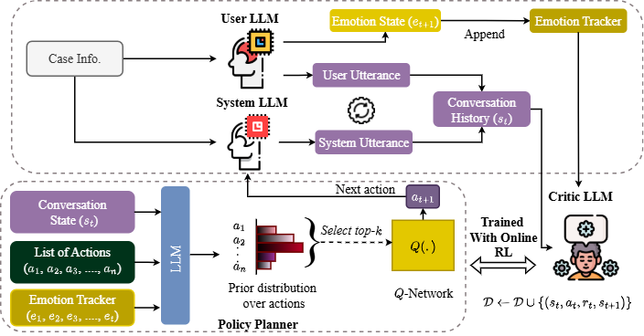

# [AAAI26] DialogXpert: Driving Intelligent and Emotion-Aware Conversations Through Online Value-Based Reinforcement Learning with LLM Priors

## Introduction

Codebase for our AAAI26 paper: [**DialogXpert**](https://ojs.aaai.org/index.php/AAAI/article/view/40244). 

Proactive dialogue systems require efficient action selection under large action spaces and evolving conversational dynamics. Hence, This repository implements a proactive dialogue planning framework that integrates:
- **LLM Priors**: to generate a rational set of action candidates.
- **Emotion Trajectory Modeling**: to track conversational dynamics.
- **Q-learning**: to select the optimal action from the subset of action candidates.

## Highlights

- **Action space reduction**: Leverages LLM priors to select top-k candidate actions, reducing the effective action space and improving sample efficiency without requiring fine-tuning.

- **Emotion-aware planning**: Introduces the integration of emotion trajectories into goal-driven dialogue, enabling context-aware and emotionally informed action selection.

- **Deep Q-learning**: Unlike existing state-of-the-art (SOTA) approaches that rely on MCTS or diffusion-based planning, our method uses Deep Q-learning over a reduced action space. This significantly improves efficiency, reducing LLM calls from 30 to 4 while maintaining competitive performance.

- **Multi-dataset approach**: Evaluated across multiple dialogue domains, including emotional support, negotiation, tutoring, and persuasion. See the dataset section for details.

## Datasets

## Usage

## Framework Overview

## Reference

...

_Old information_

Codebase for **ProactiveAI in Conversations** — an approach combining LLM priors with Q-adapters for task-oriented dialogue planning.

This repo explains the following parts:
- Downloading LLM Weights
- How the model is trained
- How the model flows based on the architecture
- Extra information

---

#### Architecure Breakdown



The architecture diagram consists of the following main components:
- Policy Planner:
- Self-Play:
- Critic LLM:
- Replay Buffer:

Reinforcement learning is done based on the replay buffer

---

### Downloading LLM Weights

Download the LLM model weights locally (it's easier because its faster to load!)

Steps:

1. Adjust the model name: https://github.com/declare-lab/dialogxpert/blob/master/download_llm_weights.py#L4-5

```
python download_llm_weights.py
```

NOTE: 

- You will need to change the `repo_id` in `download_llm_weights.py` to change the LLM weights to download.

- Please ensure that you are logged into huggingface and have the necessary tokens enabled.

---

### Training the model

Before you train the model:
- Decide the dataset to use
- Make the changes to the dataset arg (`get_args_train` -> *--data_name* parameter)
- Make changes to the necessary functions in the code in `env.py`:
    - LLM Policy Prompt: Replace with {dataset_name}_prompt (choose from `qwen_prompts.py`)
    - Roleplay functions: Replace with {dataset_name}_roleplay (choose from `qwen_prompts.py`)

After you are set, run:

```
python train_model.py
```

---

#### How Self-Play works

Training starts: https://github.com/declare-lab/dialogxpert/blob/master/train_model.py#L165

Episode loading: https://github.com/declare-lab/dialogxpert/blob/master/train_model.py#L170

Action selection: https://github.com/declare-lab/dialogxpert/blob/master/train_model.py#L178

Self-play (System): https://github.com/declare-lab/dialogxpert/blob/master/env.py#L417

Self-play (User):  https://github.com/declare-lab/dialogxpert/blob/master/env.py#L435

Critic LLM: https://github.com/declare-lab/dialogxpert/blob/master/env.py#L443

Replay Buffer: https://github.com/declare-lab/dialogxpert/blob/master/train_model.py#L228

Status Check: https://github.com/declare-lab/dialogxpert/blob/master/train_model.py#L243

---

#### How Q-learning is done

Training the network: https://github.com/declare-lab/dialogxpert/blob/master/train_model.py#L255

Adjustments: https://github.com/declare-lab/dialogxpert/blob/master/llm_priors.py#L87

---

#### Others

Prompts: https://github.com/declare-lab/dialogxpert/blob/master/qwen_prompts.py

Testing: https://github.com/declare-lab/dialogxpert/blob/master/train_model.py#L24

---

### Repository Credits

The following repositories are given credit for their open-source code utilization

```
- PPDPP: https://github.com/dengyang17/PPDPP/tree/main
- DPDP: https://github.com/cs-holder/DPDP/tree/main
- RL-LLM: https://github.com/yanxue7/RL-LLM-Prior/tree/main
```

---

